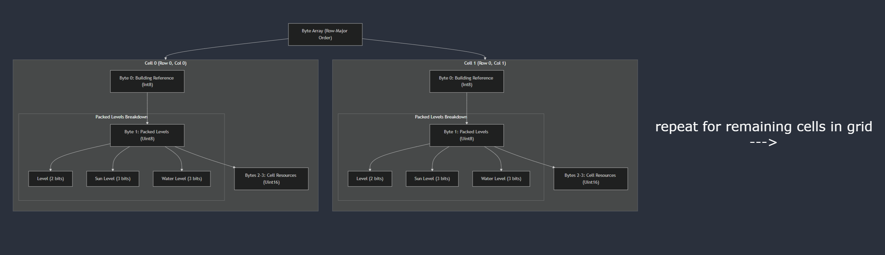

# Devlog Entry - 11/14/24

## Introducing the team

- Marco Ogaz-Vega - Engine Lead
- Ayden Le - Design Co-Lead
- Nick Corfmat - Tools Lead
- Nathan Wiinikka - Design Co-Lead

## Tools and materials

1. Our team will be using the Phaser 3 game engine given our familiarity with this framework and its support for web-based 2D game development. The engine’s environment will allow us to quickly prototype and refine the grid-based game by providing us with the necessary tools for development. Built-in features like physics, animation, and input handlers are just some examples of the development tools that will allow us to design an enjoyable game experience.

2. For this project, we will be starting out with JavaScript, as it is Phaser’s native language and will allow us to utilize its API without having to worry about compatibility issues. Additionally, we will be storing and managing all of our game’s data using JSON, given the readability and low weight of this format. JSON is also highly compatible with JavaScript—a quality that will allow us to seamlessly integrate it with our game’s source code.

3. Visual Studio Code will be our team’s primary IDE for its overall familiarity and for its ease of integration with Github. Github will be our version controller for this project so VS Code’s compatibility with it will be a major help. As for asset creation, Piskel and Aesprite will be our primary resources as they are great 2D pixel editors with lots of features applicable to game development projects.

4. We plan to migrate from JavaScript to Typescript given the close similarities both languages share, as well as the benefits Typescript offers. We will continue using Phaser as our primary game engine, however, we will have to modify our original code to account for differences between JavaScript and Typescript. For example, adding strict type-checking to functions and variables to ensure the game’s code is less susceptible to breaking and ensuring this change remains consistent with Phaser API function calls.

## Outlook

As a team, we are hoping to avert expectations about the aesthetic and design decisions in order to accomplish all the required elements of the assignment in a fun and unique way. One way we might do this is changing the overall farming aesthetic to something like sci-fi or fantasy. On the design front, we might implement Three.js in order to render 3D game objects in a browser framework. We are hoping to use our combined academic experience in Phaser 3 through our course work at UCSC to make a nice foundation for us as we continue to learn more about the engine and experiment with new libraries. We anticipate that learning typescript in the context of Phaser 3 will be our biggest hurdle as we all do not have much experience with these two in tandem.

## Sources

Astronaut sprite from "Space Runner Asset Pack" by
MattWalkden on itch.io
https://mattwalkden.itch.io/free-space-runner-pack

Cell and stats tile made in GIMP
https://www.gimp.org/

# Devlog Entry - 11/23/24

## How we satisfied the software requirements
- [F0.a] The player can control a character over a 2d grid using the arrow keys. The player also uses the mouse to select grid cells to view stats about that grid cell and any applicable buildings that might be placed there. Players can also purchase buildings when a grid cell is selected in the buy menu below the game screen.

- [F0.b] The player can advance time with the "end turn" button which is located in the buy menu below the game screen. Each turn randomly generates new sun and water levels for each cell, as well as produces collectable resources for all currently placed buildings. Resources can be accumulated over multiple turns in buildings.
  
- [F0.c] The player can place buildings and collect resources from them only when they are within one cell from them; in other words, they can only interact with adjacent cells.
  
- [F0.d] Each grid cell has a sun and water level that is randomly generated after each turn. The sun level for any given level is always a random number between 1 and 5 and only gets added to cells that contain a building. The water level for every cell starts at level 2 but every turn has an equal chance of increasing by 1, decreasing by 1, or staying the same.
  
- [F0.e] Each building has a distinct type: Drill, Excavator, or Demolition Plant. All three types of buildings have a level 1, 2, and 3. Levels are unlocked by having a different type of building next to a building.
  
- [F0.f] For every unique building placed next to each other, those buildings gain a level. In order for a building to reach level 3, it must have at least 2 unique buildings adjacent to that building's cell.
  
- [F0.g] The play scenario is satisfied when the player collects a total of 1000 resources. After the player collects 1000 resources the game is transitioned to a Win scene and the player is shown stats like how many total resources they collected, how many buildings they placed, and how many turns they took to win.

## Reflection
There were many changes we had to make in order to satisfy the F0 requirements. For example, we had to change the design of the machines and their resource collection. We had initially planned to oil the machines manually with the player so that the player has some control over how well the machines take in resources. This oil mechanic was planned to take the place of the water mechanic currently implemented. Because the water and sun had to be random in some way we had to adjust our design of our game in order to fit these requirements. We had also planned on a separate mechanic on how to level up machines using the resources they collected. However, this again had to be adjusted because of the requirements stating that growth had to be determined spatially. Our tools and materials used were the same ones we stated in the previous devlog. The familiarity with these tools aided us in our development and not many adjustments were made in this regard. Our roles were kept intact throughout this development as well.

# Devlog Entry - 11/30/24

## How we satisfied the software requirements

- [F0.a] Same as last week.

- [F0.b] Same as last week.
  
- [F0.c] Same as last week.
  
- [F0.d] Same as last week.
  
- [F0.e] Same as last week.
  
- [F0.f] Same as last week.
  
- [F0.g] Same as last week.

- [F1.a] Our game satisfies this requirement by using a single contiguous byte array in an Array-of-Structures (AoS) approach to store the grid state. The byte array format is the primary format for storing the grid state, and other formats (such as the cell objects in the grid) are derived from this byte array as needed. The state of the board is represented by a single Map of Cell structs, with each instance containing 5 numerical properties revealing information about the cell's state. As a result, it made the most sense to back the game's state in the Array-of-Structures format by converting this Map into a byte array, allowing for efficient serialization and deserialization of the grid's state. Each cell contains a building reference, building level, sun level, water level, and resources, and reconstructing the grid simply demanded we read these values from the byte array and restore them to their corresponding cells. Data such as the player state is stored outside of this byte array, since it is independent and irrelevant to the important state of the game's grid, although this data is nonetheless stored within the browser's local storage.

Grid Data Packing Diagram:

Source: diagram created with the help of Brace.
  
- [F1.b] The game provides buttons to manually save and load the game state using multiple save slots (3 to be exact). The GameState class includes methods to save the current game state to local storage and load it back, allowing the player to continue from where they left off even after quitting the game. Everything from the grid's state to the player's undo/redo history is saved locally to the browser, resulting in an exact copy to reference later on if the player wishes to load a previous session.
  
- [F1.c] An implicit auto-save system is also included that automatically saves the game without any player intervention. Every time the player makes a game-altering decision, the state of the entire game is saved to a separate "AUTO_SAVE" slot within local storage. So regardless of whether they manually saved into a slot or not, they can rest assured their progress is never lost. When the game is launched, it checks whether a previous save to "AUTO_SAVE" exists. If an auto-save entry is present, the game prompts the player with an option to continue from where they left off, ensuring safe recovery from unexpected quits.
  
- [F1.d] An undo and redo button is available in the game window that allows the player to traverse the state of the current play session, back to the very start. The GameState class implements an array of snapshots that each represent the state of the entire game after every change. Undoing/redoing changes simply involves traversing this array and deserializing the snapshot, which follows the same process as it otherwise would loading a game manually from a save slot. So everything from the player's position to the cell's resources get restored in the exact state they were in before.

## Reflection
Overall, the F1 assignment has been a lot more difficult than we anticipated. Implementing state saving and an undo system was extremely challenging with our initial design, leading us to take a step back and spend more time refactoring our approach so that it was more suitable for implementing these requirements. For example, we had to ultimately abandon representing "buildings" as objects, but rather representing them as numbers. This change made it much easier to convert our game's grid data into an "array of structures," rather than an "array of structures of structures." Figuring out how to save the move history into memory was also a challenge, since our current design would max out the browser's local storage within a few moves. This prompted us to optimize the performance of our game (such as pooling from the same objects), while also eliminating circular references within our save data. Overall, our game's internal design has evolved significantly for the better, making it much easier for us (or others) to modify in the future.

# Devlog Entry - 12/6/24

## How we satisfied the software requirements
  
### F0+F1
No major changes were made for the F0 and F1 requirements. Our previous coding structured enable us to implement the F2 requirements without significant refactoring. For example, abandoning our approach to representing building types as structs back in F1 allowed us to easily employ an external DSL to define new building types, as they can now be represented using just four primitive data types.

### External DSL for Scenario Design
We designed our external DSL to prioritize simplicity while simulatenously ensuring the user adheres to a strict structure; as a result, we felt it was most appropriate to use YAML as the main data format for our DSL. Given the YAML file, our code parses this data into a single `config` object, in which the rest of the game can read from. The YAML file is parsed at runtime using the yaml library, enabling the game to dynamically load and apply these configurations. This approach allows users to modify scenarios easily without needing to understand the main programming language. Here is an example scenario definition:

```
gridConfig:
  width: 4
  height: 5
  size: 64

buildings:
  - type: Drill
    cost: 10
    rate: 1
    scale: 1.6
    growthRule: default
  - type: Excavator
    cost: 30
    rate: 1.5
    scale: 1.6
    growthRule: waterSun
  - type: DemolitionPlant
    cost: 50
    rate: 2
    scale: 1.6
    growthRule: default

trackables:
  buildingsPlaced: 0
  resourcesCollected: 0
  turnsPlayed: 0

victoryCondition:
  type: resources
  goal: 1000

startingResources: 50

weatherCondition:
  type: drought
  startTurn: 3
  endTurn: 5
```
From the example above, we can see that the player is able to assign values to elements such as the game's grid configuration, building types, starting resources, and victory conditions. Not only can the player modify existing game elements, they can also add things like timed weather conditions that activate between specific turns, as well as apply structurally different growth rules like `'waterSun'`, which alter the conditions building types require to evolve. The external DSL can be translated as such:

1. Define a 4x5 grid with cells of size 64px wide and 64px tall.
2. Define three building types: Drill, Excavator, and Demolition Plant, each with a unique name, cost, resource production rate, asset scaling, and growth rule.
3. Start the game off a clean slate, with no buildings placed, no resources collected, and no turns played.
4. Make resources the objective of this scenario, defining 1000 resources as the goal to reach.
5. Create a drought weather condition, which starts on round 3 and ends after round 5.


Ultimately, our external DSL gives players the freedom to define their own game elements and behaviors, and play these modifications in real-time.

### Internal DSL for Plants and Growth Conditions
The program implements an internal DSL for defining different types of buildings and their unique growth conditions within the main programming language (TypeScript). Each building type is represented as an object with properties such as `type`, `cost`, `rate`, `scale`, and `growthRule`. The `growthRule` property allows for the specification of unique growth conditions, such as requiring specific sun and water levels or the presence of adjacent buildings. These conditions are not numeric differences but gameplay difference that require different sets of conditions to be met in order to level up certain buildings. This growth rule can be adjusted through either the internal DSL or external DSL from the YAML file mentioned earlier.

Here is an example code snipped demonstrating the implementation of internal DSL within the game's initialization phase:

```
 init(): void {
    const yamlText = this.cache.text.get("scenario");
    const config = parse(yamlText);

    this.gridConfig = config.gridConfig;
    this.statsConfig = {
      x: this.gridConfig.width * this.gridConfig.size,
      y: 0,
      width:
        this.game.scale.width - this.gridConfig.width * this.gridConfig.size,
      height: this.game.scale.height,
    };

    this.buildings = config.buildings.map((building: any) => ({
      ...building,
      growthRule: building.growthRule || "default",
    }));
    this.RESOURCE_GOAL = config.RESOURCE_GOAL;
    this.trackables = config.trackables;
    this.victoryCondition = config.victoryCondition;
    this.startingResources = config.startingResources || 100;
    this.weatherCondition = config.weatherCondition;
  }
  ```

  The external DSL gets parsed into a single `config` object, which includes all the scenario properties defined by the player. Since YAML lacks any sort of type checking, its contents could include game-breaking data. Unlike YAML, our host language TypeScript offers this feature and allows us to assign the contents of `config` into the scene class' fields, which have predefined property types. As a result, class properties like `this.gridConfig` will always contain three numbers: `width`, `height`, and `size`.

  The internal above can be translated as such:

  1. Retrieve the YAML configuration file and parse its data into a single `config` object.
  2. Establish the grid's width, height, and size according to how it is defined in `config`.
  3. Create a dictionary of buildings as defined by the YAML file, setting defaulting to the standard growth rule if none is provided.
  4. Define a resource goal, and other variables to track throughout the game.
  5. Assign the weather condition, as defined in `config`, to the game, and carry out its instructions later by reading from its properties.

### Switch to Alternate Platform
Porting our codebase from JavaScript to TypeScript was a more demanding challenge than we had anticipated, mainly due to the fact with how TypeScript gets deployed to the browser. Unlike JavaScript, TypeScript cannot run on browsers and therefore must be transpiled into JavaScript beforehand. After translating our code to TypeScript, we noticed that it would not live-update anytime we saved changes to our code. This happened due to the fact that our TypeScript code transpiled once into JavaScript and never again, for any subsequent changes. At this point our team realized that we should have used Deno for rapid deployment, since this tool offers the benefit of transpiling TypeScript at runtime. Instead, we opted to reconfigure `tsconfig.json` to reflect the need for continuous monitoring. Also enabling watch mode by running `tsc --watch` on the command line helped us continously deploy our game into the browser.

In regards to the actual process of converting our code to TypeScript, the bulk of the work involved adding strict type-checking and creating new structs to represent data more explicitly. Since we were constantly passing references of Phaser's built-in Scene object in JavaScript, we needed to rectify new structs to represent the specific Scene types and properties we were referencing across different classes. For example,
```
class Grid { 
    constructor(scene, gridConfig) {...}
}
```
Now became:
```
class Grid { 
    constructor(scene: PlayScene, gridConfig: GridConfig) {...}
}
```
From the example above, `scene` had to constrained to be of type `PlayScene` given how it consists of a specific list of properties. If we were still working in JavaScript, we could have easily passed `LoadScene` to the Grid's constructor without compilation errors, yet this would have inevitably broken the game once Grid needed to access properties exclusive to `PlayScene`. TypeScript removes this vulnerability by requiring type-checking for all variables, function arguments, and return values, making it the safer language to work with.

Ultimately, the process of switching from the JavaScript to Typescript mainly demanded we pay closer attention to how the deployment process works, but for the most part, proved to be a manageable transition. As of right now, our team is more confident in our code's resilience thanks to the integration of strict type-checking.

## Reflection
Our team learned from F2 about the importance of building a solid foundation for creating strong, adaptable code. Migrating our codebase from JavaScript to TypeScript proved to be a bigger challenge than it should have, since it essentially broke our entire game. We had to change how we represented structs in order to have stricter definitions. Additionally, adding external and internal DSLs meant our code had to become more dynamic, a feature that meant rewriting a lot of exisiting code. One key decision we made early on that spared ourselves from a lot of stress during this step, was stepping away from representing buildings as complex structs, but rather simple objects with primitive data types. Overall, our focus right now has changed to prioritize dynamic code in order to set the game up for easier expansion.